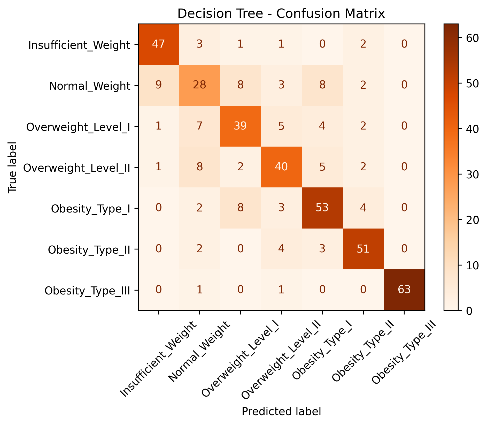

## Análise das Matrizes de Confusão dos Modelos de Classificação
Introdução
Neste relatório, focamos na análise das matrizes de confusão dos modelos Naive Bayes, KNN e Decision Tree, aplicados a um conjunto de dados de obesidade. O objetivo é comparar o desempenho dos modelos e identificar padrões de erro, especialmente na classificação de "Peso Normal".

### Naive Bayes
 O Naive Bayes apresenta dificuldades significativas, especialmente na classificação de "Normal Weight", que é frequentemente confundido com "Overweight Level I". Isso reflete a limitação do modelo em capturar a correlação entre as features.
- Tendência de Erro: Há uma clara tendência de classificar erroneamente "Normal Weight" como "Overweight Level I", indicando que o modelo não consegue distinguir bem entre essas classes.

  {width=35%}

### KNN
 O KNN mostra uma performance superior, com menos confusões entre "Normal Weight" e "Overweight Level I". O modelo é mais preciso em classes extremas como "Obesity Type III".
- Tendência de Erro: Embora o KNN tenha melhorado a classificação, ainda há erros na distinção entre "Normal Weight" e "Overweight Level I", mas em menor escala comparado ao Naive Bayes.

  {width=35%}
### Decision Tree
 O Decision Tree tem uma performance intermediária. Ele consegue capturar melhor a complexidade do conjunto de dados, mas ainda comete erros na classificação de "Normal Weight".
- Tendência de Erro: Similar ao KNN, o Decision Tree também confunde "Normal Weight" com "Overweight Level I", mas consegue classificar melhor as classes de obesidade mais severas.

  {width=35%}

A análise das matrizes de confusão revela que todos os modelos têm dificuldades em distinguir "Normal Weight" de "Overweight Level I". O KNN apresentou a melhor performance geral, mas ainda há espaço para melhorias. Sugere-se explorar modelos que considerem a correlação entre features para melhorar a acurácia.