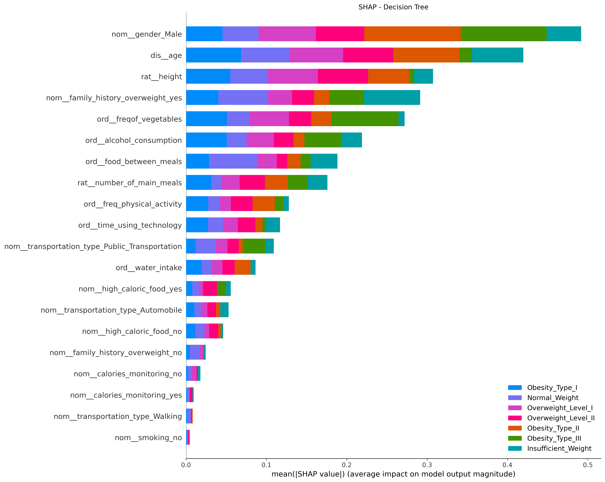

mostrar os shap de barra
(dica: coloca a imagem no gpt q ele explica oq cada coisa no grafico significa, é bem util)

- falar sobre as features mais influentes em cada modelo para cada classe (ver as cores)
- falar sobre algumas coisas que na verdade na teoria não deveriam influenciar (genero por exemplo) -- algo de errado ou padrão obscuro encontrado pelo modelp (não falar sobre isso, coloquei essa ultima pergunta pra refletir sobre e falar indiretamente sobre)

## Análise de Importância das Features

Nesta seção, analisamos a importância das features para cada um dos modelos analisados usando gráficos de SHAP. O objetivo é identificar quais features são mais influentes em cada classe e discutir possíveis padrões inesperados.

### Naive Bayes

- As features mais influentes incluem "height", "weight", e "freqof_vegetables". Essas são esperadas, pois estão diretamente relacionadas à obesidade.
- **Assunção de Independência**: O Naive Bayes assume que todas as features são independentes entre si, o que pode limitar sua capacidade de capturar interações complexas entre as features. 
{width=100%}

{width=100%}

### KNN

- "Height", "gender" e "weight" são novamente as mais influentes, seguidas por "age" e "freqof_vegetables". Isso está alinhado com a expectativa, dado o contexto do problema.

{width=100%}

### Decision Tree

- "Height", "gender", "weight", e "age" são as principais, com "freqof_vegetables" também sendo significativa. O modelo parece capturar bem as variáveis mais relevantes.

{width=100%}

{width=100%}

#### Conclusão

Os gráficos de SHAP revelam que "height" e "weight" são consistentemente as features mais influentes em todos os modelos. No entanto, a presença de "Gender" como uma feature influente sugere que os modelos podem estar capturando padrões inesperados ou viéses nos dados. No caso do Naive Bayes, a suposição de independência entre as features pode estar contribuindo para a identificação de padrões que não são teoricamente esperados.
